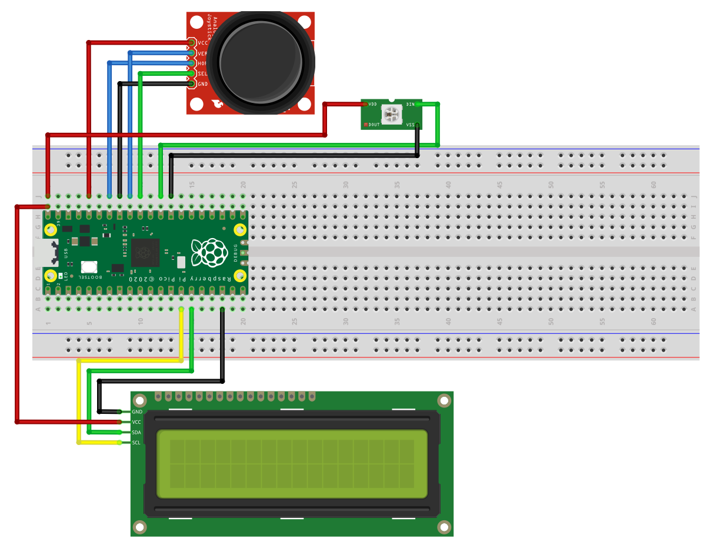

Hardware ColorPicker for NeoPixel
====================================

This is a hardware colorpicker for NeoPixel LED strips. It is used for picking gradient patterns.

The motivation of creating this project is that NeoPixel colors have large different than the same colors on computer screens, 
which makes it impractical to create NeoPixel colors with computer tools.
This hardware colorpicker allows you to adjust the colors and see their HSV values in real time.

The program is written in [CircuitPython](https://circuitpython.org/). The following libs are used:

- [neopixel](https://circuitpython.org/libraries)
- [adafruit_fancyled](https://circuitpython.org/libraries)
- [lcd](https://github.com/dhalbert/CircuitPython_LCD)

## Breadboard

## Case

The STL files for the case is provided under the [STL](stl/) folder.
However, I cannot guarantee that they fit your parts. Please use them as reference only;
always measure your parts and create your own 3D model.

## License

Shield: [![CC BY-NC-SA 4.0][cc-by-nc-sa-shield]][cc-by-nc-sa]

This work is licensed under a
[Creative Commons Attribution-NonCommercial-ShareAlike 4.0 International License][cc-by-nc-sa].

[![CC BY-NC-SA 4.0][cc-by-nc-sa-image]][cc-by-nc-sa]

[cc-by-nc-sa]: http://creativecommons.org/licenses/by-nc-sa/4.0/
[cc-by-nc-sa-image]: https://licensebuttons.net/l/by-nc-sa/4.0/88x31.png
[cc-by-nc-sa-shield]: https://img.shields.io/badge/License-CC%20BY--NC--SA%204.0-lightgrey.svg

